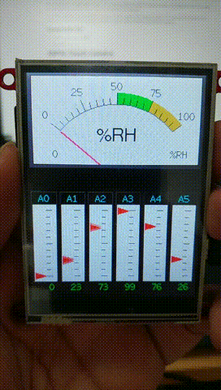
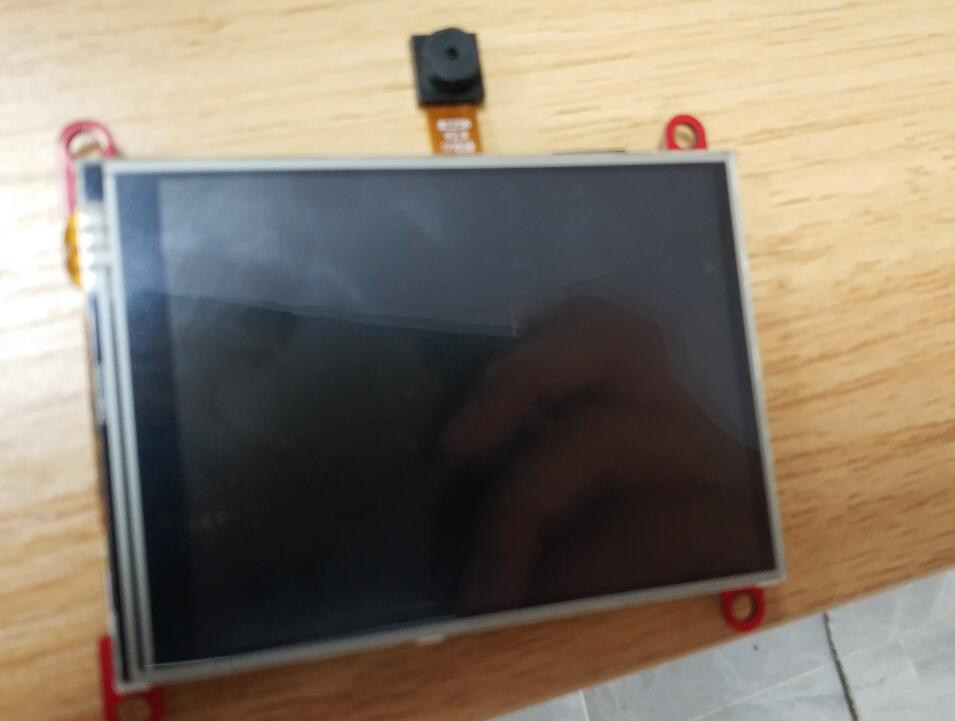
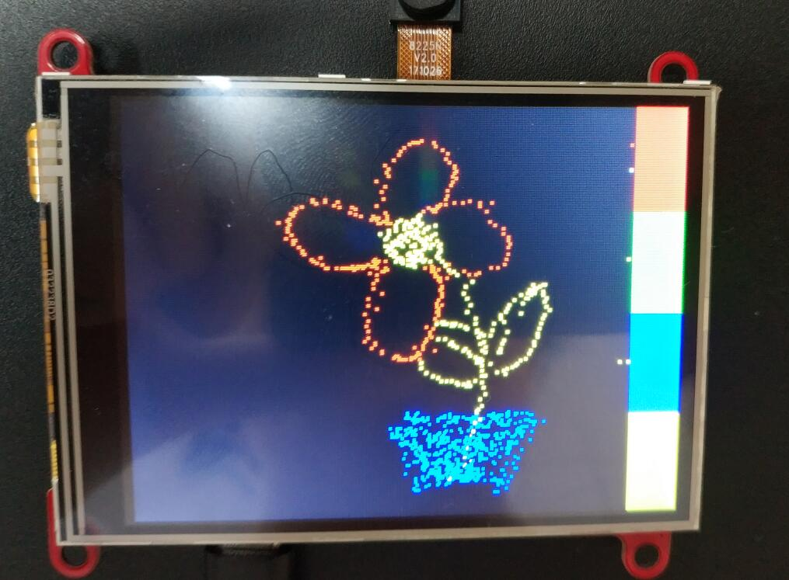
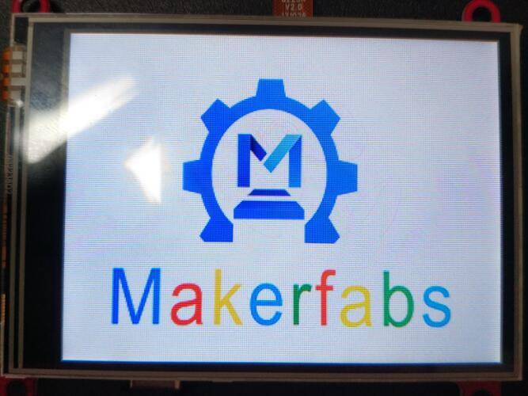

# Touch Screen Camera ILI9341

```c++
/*
Version:		V1.0
Author:			Vincent
Create Date:	2020/9/28
Note:
	
*/
```




[toc]

# OVERVIEW

## Introduce

[Makerfabs home page](https://www.makerfabs.com/)

[Makerfabs Wiki](https://makerfabs.com/wiki/index.php?title=Main_Page)

The realization of a simple digital camera, you can take pictures through the camera framing. It is displayed on the TFT screen and provides touch options. Photos taken can be saved on an SD card.

The ILI9341 screen has more adaptation libraries. Such as Adafruit_GFX, Adafriut_ILI9341, TFT_eSPI and other libraries. The resistance screen is driven by Adafruit_STMPE610 library. Fully compatible with Adafruit products.


## Equipment list

- ESP32 Touch Camera ILI9341
- Micro SD card


# ESP32 Touch Camera

## Product link ：[Not ready]() 

The ESP32 Touch Camera ILI9341 use ILI9341 screen, which comes with resistive screens. Have an OV2640 camera and SD card slot. It can be used as a webcam, an electronic album, or a digital camera. Support for Arduino and MicroPython. 

## Feature

- Integrated ESP32 2.4G WiFi and Bluetooth.
- Micro SD card slot on board.
- Input 5.0V Type-C USB .
- OV2640 is a 1/4 inch CMOS UXGA (1632*1232) image sensor manufactured by OmniVision.
- LCD 3.2 inch Amorphous-TFT-LCD (Thin Film Transistor Liquid Crystal Display) for mobile-phone or handy electrical equipments. The resolution is 320*240.
- STMPE610 is A 4-wire resistive touch screen control circuit with I2C interface and SPI interface.





# Example

## Camera

This is a test demo. You can check that ESP32, screen, touch, SD card reader and the camera function properly.

- Copy logo.bmp to sd card.
- Insert SD card.
- Upload code to ESP32.
- Restart ESP32.
- Screen will show "TOUCH TO START TEST", please touch screen.
- Will show logo picture in SD card.
- And ESP32 will open camera, and show on screen.

## Example introduction

Five projects were implemented : "Graphic_Test", "Touch_Test", "Touch_Draw", "SD_Test" and "Wifi_Camera".

### Graphic_Test

- Test ILI9341 screen with Adafruit_ILI9341 library.

### Touch_Draw

- Test ILI9341 screen with Adafruit_STMPE610 library.

### Touch_Draw

- Use your hand or stylus (resistance screen) to draw on the screen.



### SD_Test

- Display pictures from SD card.



### Wifi_Camera

- Use esp32 and ov2640 as a webcam.
- Provides a real-time display of the control web page.


## Compiler Options

**If you have any questions，such as how to install the development board, how to download the code, how to install the library. Please refer to :[Makerfabs_FAQ](https://github.com/Makerfabs/Makerfabs_FAQ)**

- Install board : ESP32 .
- Install library : Adafruit_GFX library.
- Install library : Adafruit_ILI9341 library.
- Install library : Adafruit_STMPE610 library.

- Insert a Micro SD card into ESP32 Touch Camera.
- Upload codes, select "ESP32 Wrover Module" and "Huge APP"


## Code Explain

- Import Library

```c++
#include "SPI.h"
#include "SD.h"
#include "FS.h"
#include "Adafruit_STMPE610.h"
#include "Adafruit_GFX.h"
#include "Adafruit_ILI9341.h"
```


- Define Pins

```c++
//SPI
#define SPI_MOSI 13
#define SPI_MISO 12
#define SPI_SCK 14

//SD Card
#define SD_CS 4

//Touch Screen
#define STMPE_CS 2

//TFT
#define TFT_CS 15
#define TFT_DC 33
#define TFT_LED -1 //1//-1
#define TFT_RST -1 //3//-1
```


- Set Cs function. Because the screen, touch and SD card all use SPI interface. To prevent SPI conflicts, the manual SPI switch is set. Low is enable.

```c++
//SPI control
#define SPI_ON_TFT digitalWrite(TFT_CS, LOW)
#define SPI_OFF_TFT digitalWrite(TFT_CS, HIGH)
#define SPI_ON_SD digitalWrite(SD_CS, LOW)
#define SPI_OFF_SD digitalWrite(SD_CS, HIGH)
#define STMPE_ON digitalWrite(STMPE_CS, LOW)
#define STMPE_OFF digitalWrite(STMPE_CS, HIGH)
```


- Init SPI

```c++
SPI.begin(SPI_SCK, SPI_MISO, SPI_MOSI);
```

